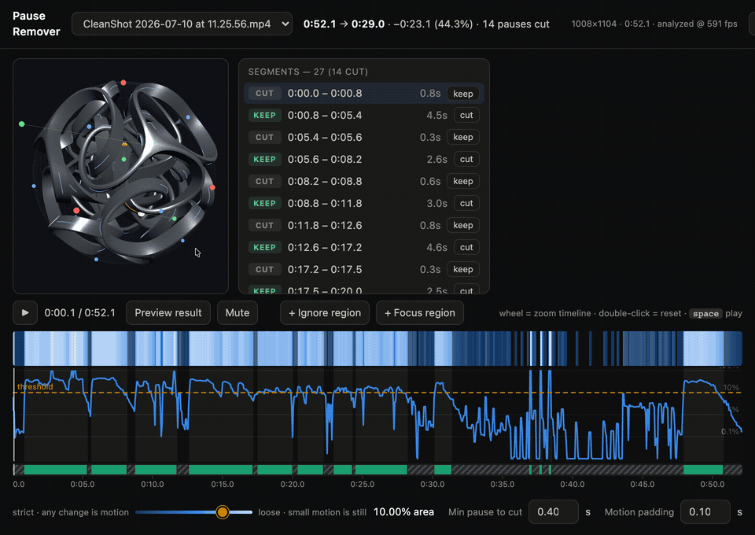

# Video Pause Remover

Cuts the dead time out of videos — every second where nothing moves on screen — and writes a file that is your **original video, untouched, minus the pauses**.

Analysis runs on the GPU — [MLX](https://github.com/ml-explore/mlx)/Metal on Apple Silicon, CuPy/CUDA on NVIDIA — at ~600 fps (≈20× realtime), with hardware decode (VideoToolbox / NVDEC) and a NumPy CPU fallback everywhere else. The export is a *smart cut*: in typical screen recordings ~90% of output frames are **bit-identical stream copies** of the source; only sub-GOP slivers at cut boundaries are re-encoded (libx264 crf 12).

<p align="center"></p>

<p align="center"><em>Drag the threshold from strict (any change is motion) to loose; the keep/cut segments, stats, and heatmap update live off a cached analysis. Preview plays the result before you export.</em></p>

## Quick start

```sh
brew install ffmpeg                         # (or apt/choco; any ffmpeg ≥ 5 on PATH)
python3 -m venv .venv && .venv/bin/pip install -r requirements.txt
.venv/bin/pip install cupy-cuda12x          # NVIDIA only, match your CUDA version

.venv/bin/python server.py recording.mp4    # web UI at http://localhost:8765
.venv/bin/python cli.py recording.mp4       # headless, writes recording.nostills.mp4
```

The compute backend auto-detects (MLX → CuPy → NumPy); force one with
`--backend` or `PAUSE_REMOVER_BACKEND`. Decode acceleration picks
VideoToolbox on macOS and NVDEC when `nvidia-smi` is present, and falls back
to software decode automatically if the hardware path fails.

The first open of a file runs a one-time analysis pass, cached in `cache/` — every later operation (thresholds, regions, re-exports) works from the cache and never touches the video again until export.

## The UI

- **Threshold slider** — left end is fully strict (*any* pixel change counts as motion; only frozen frames get cut), sliding right treats progressively larger changes as still. Default: 10% of frame area.
- **Change timeline** — log-scale heatmap + curve of per-frame change, with the threshold as a draggable line, a keep/cut track, hover readout, and wheel-zoom.
- **Regions** — draw *ignore* boxes (mask a clock, a blinking REC dot) or *focus* boxes (only this area counts). Applied instantly from cached tile metrics, no re-analysis.
- **Segment list** — every keep/cut span, click to seek, force-keep or force-cut any of them.
- **Preview result** — playback that skips the cuts, so you hear/see the output before writing it.
- **Export** — one button. The toast reports how much was stream-copied vs re-encoded, A/V sync delta, and a decode check.

## The CLI

```sh
.venv/bin/python cli.py input.mp4 [-o out.mp4] [--json] [--dry-run]
    [--threshold PCT] [--min-pause SEC] [--pad SEC]
    [--ignore X0,Y0,X1,Y1] [--focus X0,Y0,X1,Y1] [--mode smart|reencode]
```

`--dry-run --json` prints the full cut plan without writing anything; the export report includes `copied_pct`, `av_desync_ms`, and a `decode_errors` field from an automatic validation pass. Exit code 0 with `"out_path": null` means "nothing to cut." Agents: see [.claude/skills/remove-pauses/SKILL.md](.claude/skills/remove-pauses/SKILL.md).

## How it works

1. **Analyze once.** ffmpeg (VideoToolbox/NVDEC) decodes ~288 px grayscale frames at 30 fps CFR (VFR-safe), batched into GPU tensors (`backend.py`: MLX, CuPy, or NumPy — same numerics, verified bit-equal on the frac metric, so caches are backend-independent). Per frame-pair, the GPU computes an 8 px-tile grid of two metrics: mean |Δluma| and the fraction of pixels changed beyond a noise gate auto-estimated from the footage (MAD-based). Global luma is normalized first, so exposure flicker never reads as motion. The tile grid is why region masks are free afterward.
2. **Tune instantly.** Threshold with hysteresis (0.5× exit ratio) → absorb stills shorter than `--min-pause` → pad motion outward by `--pad`. Pure array math over the cached curve, identical in the UI (JS) and CLI (`segmentation.py`).
3. **Smart-cut export.** Per kept segment, everything from the first keyframe onward is stream-copied; only the slice before it is re-encoded near-losslessly. Audio is cut with each piece (AAC at source bitrate, 4 ms edge fades so joins never click) and A/V travel together per piece, so sync error cannot accumulate. Output validation (decode check, duration, A/V delta) runs on every export.

## Notes & limits

- GPU paths: Apple Silicon (MLX/Metal, VideoToolbox) and NVIDIA (CuPy/CUDA, NVDEC). Anything else runs on the NumPy backend with software decode — the pipeline is decode-bound, so CPU analysis is still fast (~realtime × 15 on short clips). Stock ffmpeg + Python ≥ 3.11. The NVIDIA path shares its exact code with the tested NumPy path but hasn't been run on NVIDIA hardware yet — reports welcome.
- Audio during pauses is removed with the video — narration over a still screen gets cut. Mask regions or raise `--min-pause` if that's wrong for your material.
- Smart cut splices re-encoded and original H.264 into one stream. Chrome, ffmpeg, QuickTime handle it; if a player ever glitches at a cut point, use `--mode reencode`.
